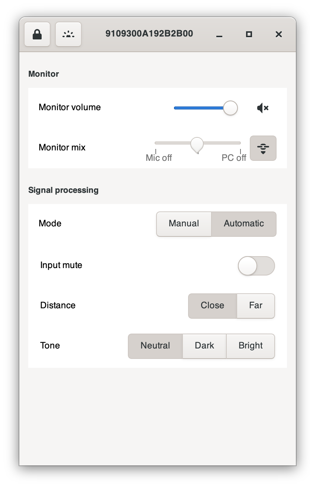
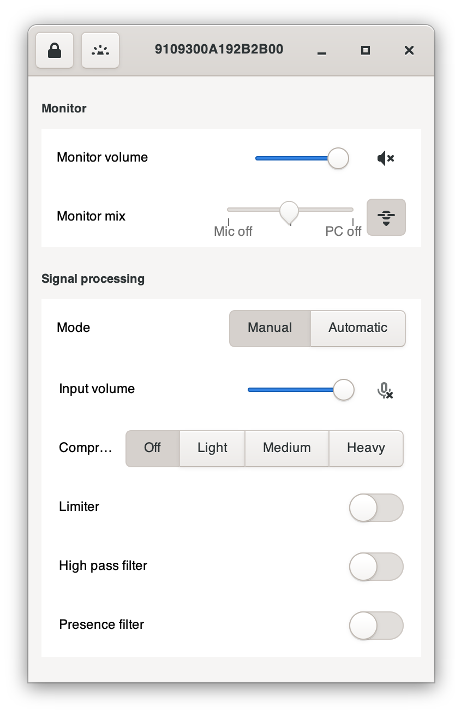

# mv7config

Unofficial utility for configuring Shure MV7 microphones for Linux and macOS.


## Linux


How to start the App

```bash
% cd <WHERE-YOU-DOWNLOADED>
% python3.11 ./gui.py
```

## macOS

How to start the App

```bash
% cd <WHERE-YOU-DOWNLOADED>
% python3.11 ./gui.py
```

### automatic setup


## manual setup



### Installation macOS

1. Install Cython (C to Python)
```
% git clone --recursive https://github.com/trezor/cython-hidapi.git
% cd cython-hidapi
% python3.11 setup.py build
% sudo python3.11 setup.py install
% pip install -e .
```

2. Install hidapi and hid

```
% brew install hidapi
```

```
% pip install hid
```


3. Install macOS native drivers

https://github.com/libusb/hidapi/blob/master/BUILD.md#mac

https://github.com/libusb/hidapi/blob/master/BUILD.md#mac

```bash
% mkdir build
% cd build
% cmake ..
% make
[ 50%] Building C object src/mac/CMakeFiles/hidapi_darwin.dir/hid.c.o
[100%] Linking C shared library libhidapi.dylib
[100%] Built target hidapi_darwin

% make install
[100%] Built target hidapi_darwin
Install the project...
-- Install configuration: "Release"
-- Installing: /usr/local/lib/libhidapi.0.15.0.dylib
-- Installing: /usr/local/lib/libhidapi.0.dylib
-- Installing: /usr/local/lib/libhidapi.dylib
-- Installing: /usr/local/include/hidapi/hidapi.h
-- Installing: /usr/local/include/hidapi/hidapi_darwin.h
-- Installing: /usr/local/lib/pkgconfig/hidapi.pc
-- Old export file "/usr/local/lib/cmake/hidapi/libhidapi.cmake" will be replaced.  Removing files [/usr/local/lib/cmake/hidapi/libhidapi-release.cmake].
-- Installing: /usr/local/lib/cmake/hidapi/libhidapi.cmake
-- Installing: /usr/local/lib/cmake/hidapi/libhidapi-release.cmake
-- Installing: /usr/local/lib/cmake/hidapi/hidapi-config-version.cmake
-- Installing: /usr/local/lib/cmake/hidapi/hidapi-config.cmake
```


4. Test your Python HID installation

```
% python3.11
>>> import hid
>>> hid.version
(0, 15, 0)
```

If you can load hid then hid is installed on Python.


### mv7config

```
% python3.11 ./repl.py
No MV7 microphone found
```

Plug in microphone.

```
% python3.11 ./repl.py
> help
audioMute      micMute        volume         inputGain
fwVersion      serialNum      dspMode        dspVersion
bootDSP        getSampleRate  getBlock       setBlock
pkgVersion     lock           myCID          dimMode
meterMode      rateMismatch   deviceType     interfaceId
identify       getSN          getSAPSN       

> fwVersion
fwVersion=0.0.49.0

> dspVersion

dspVersion=0.0.5.22

> pkgVersion

pkgVersion=1.2.17 

> interfaceId

interfaceId=0.3.0

> identify

OK

```

Hit CONTROL+C to exit.


### FAQ

Problem:
- app does not start, microphone does not work, etc.

Solution:
- Just un-plug the USB-Calbe for about 10 seconds. Plug the USB-Calbe in again, wait again about 10 seconds after the microphone has completely booted (LEDs will stop blinking), then try again.


Problem:

```
ValueError: Namespace Handy not available
```

Solution:

```
% brew install libhandy
```


